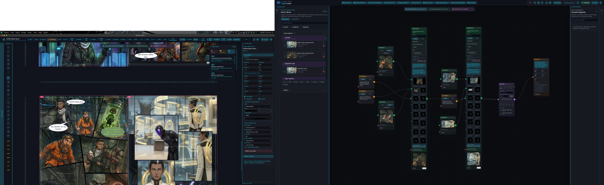

# Signal Loom

[](https://buymeacoffee.com/es00bac)

Signal Loom is an AI media suite with four applications sharing one project model and one source library:

- **Flow**: build generation and orchestration graphs.
- **Video**: edit timeline sequencing, compositing, keyframes, and rendering.
- **Image**: perform layer-based image editing and model-driven visual retouching.
- **Paper**: do page-based publishing and print-ready layout for comics, books, and long-form documents.

The suite runs from the same `.sloom` project and automatically synchronizes media between apps so Flow outputs can be consumed in Image, Paper, or Video without re-importing assets.

The app runs in a normal browser through Vite and also ships as an Electron desktop app with native file dialogs and a KDE Plasma global menu.

## Screenshots

<figure>
  
  <figcaption><strong>Current version.</strong> Current application screenshot from a recent desktop run.</figcaption>
</figure>

<figure>
  
  <figcaption><strong>Flow workspace.</strong> Build reusable generation graphs with prompt, image, video, source-bin, and composition nodes while tracking run cost and keeping generated assets in the project library.</figcaption>
</figure>

<figure>
  
  <figcaption><strong>Video workspace.</strong> Assemble source-bin media on a multi-track timeline, tune source/program monitors, and keyframe clip transform and opacity from the inspector.</figcaption>
</figure>

## Features

- Node-based workflow canvas built with React Flow.
- Prompt, text, image, video, audio, and composition nodes.
- Layered Image editor with masks, region tools, canvas transforms, multiple export formats, and model-in-the-loop operations.
- Paper workspace with page grids/rulers/guides, linked-frame placement, comic bubble and speech tooling, and print-ready export options.
- Timeline editor with source bins, editor assets, text and shape overlays, crop controls, clip cuts, gaps, snapping, keyframes, opacity, volume, and transform animation.
- Browser and Electron project workflows that can save and reopen `.sloom` project files.
- Shared Source Library and project scratch references so generated/imported assets are reused across all four apps.
- Optional local native render helper for FFmpeg-backed rendering.
- Optional remote preview gateway for self-hosted browser access.

## Providers

Signal Loom uses your own provider accounts and model access. Provider keys are not included in this repository.

Currently wired provider paths include:

- Text: Google Gemini, OpenAI-compatible chat, Hugging Face chat completion.
- Image: Google Gemini image generation, OpenAI image generation, Hugging Face diffusion.
- Video: Google Veo through Gemini long-running jobs, Hugging Face text-to-video.
- Audio: ElevenLabs text-to-speech, Hugging Face text-to-speech.

In browser mode, provider keys are entered in the app settings and stored in local browser storage. In Electron mode, the renderer uses the same settings flow with native project/file integration.

## Requirements

- Node.js 20 or newer.
- npm.
- Optional: Electron-capable desktop session for the native app.
- Optional: FFmpeg for local/native rendering paths.

## Development

Install dependencies:

```bash
npm install
```

Run the browser app:

```bash
npm run dev
```

Run the Electron app:

```bash
npm run electron
```

Run the Electron app against the Vite dev server:

```bash
npm run electron:dev
```

Build, test, and lint:

```bash
npm run build
npm run test
npm run lint
```

## Desktop Integration

The desktop launcher files live in `packaging/` and `scripts/`. The public launcher assumes `signal-loom-electron` is installed somewhere on your `PATH`.

The systemd units under `ops/` are examples for local native rendering and optional remote access. Copy the matching `.env.example` file, replace all placeholder values locally, and do not commit the real environment file.

## Security Notes

- Never commit real provider API keys, tunnel tokens, SSH keys, project scratch directories, rendered output, or `.sloom` project files that contain private media references.
- `.env`, `.env.*`, scratch folders, generated output, Playwright state, and local notes are ignored by default.
- Remote access helpers are optional and must be configured with your own secrets outside the repository.

## Documentation

- Full user guide and feature help: `docs/PROJECT_DOCUMENTATION.md`
- Current task list: `docs/TASK_LIST.md`
- Handoff and architecture notes: `docs/HANDOFF.md`

## License

Signal Loom is licensed under the GNU Affero General Public License v3.0 or later. See `LICENSE`.
