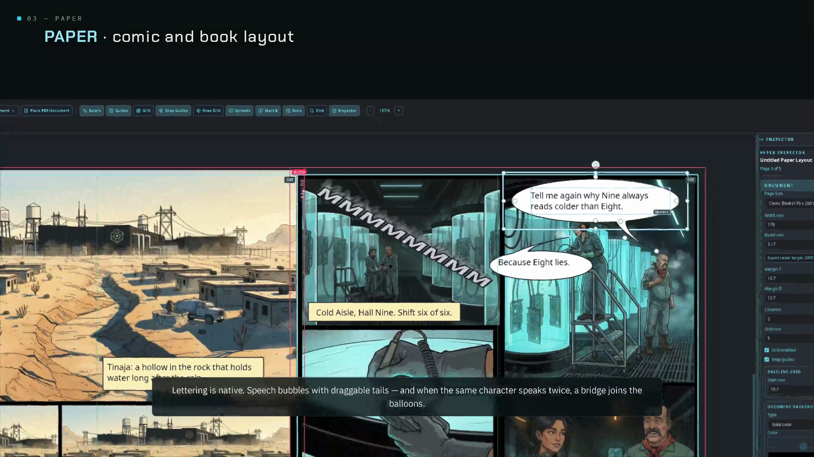
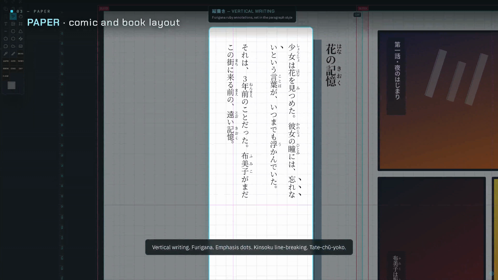
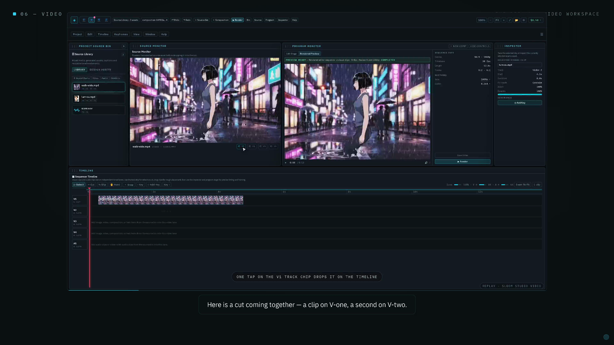

# Sloom Studio

### The creative suite you own. Buy once.

[](https://buymeacoffee.com/es00bac)
[](https://github.com/Es00bac/signal-loom/releases/latest)
[](LICENSE)

Sloom Studio (formerly Signal Loom) is a local-first creative suite: layered illustration,
comic and book layout, and video editing, all sharing one project file. No subscription, no
account, no telemetry. Draw, letter, lay out, and export, in one app you own outright. A
node-based generation graph is in there too, for when you want it. It's entirely optional,
and you can build a whole project without ever opening it or adding a single API key.

**[Download free](#download) &middot; [Watch the 17-minute tour](https://youtu.be/7-imCNPPXZM) &middot; [Who it's for](#who-its-for) &middot; [License](#license)**

## Screenshots

<p>
  
  
  
</p>

**Paper**, comic lettering: real speech bubbles with draggable tails, native to the layout
tool, no round-trip to a separate app. **Paper**, Japanese typesetting: genuine vertical
writing (tategaki) with furigana, not a translate-and-hope bolt-on. **Video**, the
multitrack timeline: source and program monitors, keyframes, and a real edit in progress,
not a slideshow tool bolted onto a paint app.

More screenshots, and the full 17-minute walkthrough of all four workspaces, painting to
print-ready: **[https://youtu.be/7-imCNPPXZM](https://youtu.be/7-imCNPPXZM)**

## What it is

Four workspaces, one `.sloom` project, one shared source library. Media moves between them
without re-importing.

- **Paper**: page-based publishing and print-ready layout for comics, books, and long-form
  documents. Comic bubbles (with same-speaker bridge), captions, panels, gutter knife, a
  Comic SFX Designer, threaded text with OpenType, hyphenation, drop caps, styles,
  find/change, hyperlinks, tables, Japanese vertical writing and furigana. Exports to PDF,
  KDP, booklet, webcomic, CBZ, HTML, IDML, JSON, and (on the commercial license)
  print-production PDF/X-4 and PDF/X-1a with CMYK and spot-color separations.
- **Image**: layer-based image editing and model-driven visual retouching. Full
  pressure/tilt/symmetry brush engine, layers with 16 blend modes, 9 layer effects, 8
  adjustment layers, masks, PSD in/out.
- **Video**: timeline sequencing, compositing, and keyframes. Multitrack timeline (visual +
  4 audio tracks), transitions, clip filters, 10 render presets (H.264, HEVC, ProRes, VP9,
  GIF).
- **Flow** (optional): a node-based generation and orchestration graph, for teams who want
  an AI-assisted pipeline into the other three workspaces. Bring your own provider keys;
  nothing runs, and nothing costs anything, until you add one.

The app runs in a normal browser through Vite, ships as an Electron desktop app with native
file dialogs and a KDE Plasma global menu, and ships as an Android/DeX app (Capacitor) with
file-manager intents, volume-key modifiers, an on-device LAN app server, and an on-device
upscaler.

> **Complete, code-audited feature inventory** (every node, tool, capability, provider, and
> Desktop/Android availability): [`docs/FEATURE_BREAKDOWN.md`](docs/FEATURE_BREAKDOWN.md).

## Who it's for

**Self-publishing comic and book creators, first.** If you draw, letter, lay out, and want
to end up with a print-ready or KDP-ready file, without stitching a paint app, a layout app,
and a print-prep tool together, this is built for exactly that. Paper's comic tooling
(bubbles, panels, gutter knife, SFX designer) and its print pipeline (PDF/X-4, PDF/X-1a,
CMYK and spot-color separations, IDML) live in one project alongside the art itself. If you
also want Japanese vertical typesetting and furigana, that's in the same tool, at no extra
step. This is the workspace almost nothing else at this price bundles.

**If you're primarily a painter, illustrator, or inker** looking for the best raster
painting or inking engine on its own, we'll say it straight: Krita (free) or Clip Studio
Paint will likely serve you better today for that alone. Sloom's Image workspace is a
competent layered editor, not yet a Photoshop or Clip Studio replacement on painting and
inking. What Sloom adds is the rest of the pipeline around it (letter it, lay it out,
export it print-ready) in the same project, which neither of those tools does.

**AI-comfortable solo creators** who want an optional generate-to-print pipeline (Flow into
Paper) in one owned app, bringing your own provider keys, are a good secondary fit.

## Download

**[sloom.studio](https://sloom.studio)** has the current build for every platform, with a
free Community download front and center and the commercial license next to it. Windows and
Linux are stable; an experimental, unsigned macOS build also exists (Apple Silicon and
Intel; right-click, Open to pass Gatekeeper on first launch since it isn't notarized yet);
Android ships as a free app and through Samsung DeX.

**[GitHub Releases](https://github.com/Es00bac/signal-loom/releases)** carries the same
prebuilt installers (`.exe`, `.AppImage`, `.deb`, `.dmg`, `.apk`) attached to each tagged
version, alongside the source at that tag, if you'd rather get the binary straight from
here.

**Free Community edition.** Every download, from either place, is the full app: all four
workspaces, every export except the professional print pipeline, no watermarks, free
forever for personal and noncommercial use. No account, no time limit; the only nag is a
once-a-day reminder that the paid tier exists.

**Commercial license.** A one-time **$17.99 beta price through version 0.9.x**, rising to
**$39 starting with version 1.0**, unlocks the professional print-production exports: PDF/X-4,
PDF/X-1a, KDP-ready PDF, Adobe IDML, and CMYK/spot-color separations, and removes the
Community notice. One license key covers desktop and Android. Buy it from
[sloom.studio](https://sloom.studio/#license).

## Features

- **Paper**: 16 tools, 8 frame kinds; page presets (Letter to Webtoon), columns, document +
  baseline grids, spreads; threaded text with runaround, OpenType, hyphenation, drop caps,
  styles, find/change, hyperlinks, tables; comic bubbles (with same-speaker bridge),
  captions, panels, gutter knife, Comic SFX Designer; CMYK/spot swatches and **PDF/X-4 /
  PDF/X-1a** print production; export to PDF, KDP, reader-spreads, booklet, webcomic, HTML,
  IDML, CBZ, stories (TXT/HTML/RTF/DOCX), JSON.
- **Image**: 26 tools with selection modes + Quick Mask + Select & Mask; layers with 16
  blend modes, 9 layer effects, 8 adjustment layers, 7 filters; full pressure/tilt/symmetry
  brush engine; gradients and vector shapes; artboards + CMYK soft-proof; model-in-the-loop
  AI (text-to-image, edit, mask-inpaint, outpaint, erase, search-replace/recolor,
  remove-background, relight, upscale); PNG/PSD/`.slimg` export.
- **Video**: multitrack timeline (visual + 4 audio tracks), transitions, 8 clip filters,
  stage objects with blend modes; keyframe animation of transform/opacity/crop/volume; 10
  render presets (H.264/HEVC/ProRes/VP9/GIF/PNG-JPEG sequences) over AMD-VAAPI to
  native-CPU to browser-FFmpeg backends.
- **Flow** (optional): node graph (React Flow) of 60 node types in 10 categories: Generate
  (image/video/audio/composition), Inputs & Data, Lists & Envelopes, Flow Control, Logic &
  Math (JS/Python/SQL/regex/JSON/HTTP/CSV/XML-YAML/math), Text & Story tools, Reuse & Layout
  (functions/groups/portals/aliases), Monitor, and Settings; per-node cost + execution
  telemetry.
- Browser, Electron, and Android project workflows that save/reopen `.sloom` (plus
  `.slimg`/`.slppr`).
- Shared Source Library + per-project scratch so generated/imported assets are reused
  across all four apps.
- Optional local native FFmpeg render helper (desktop); optional remote preview gateway /
  Android LAN app server.
- API keys encrypted at rest (OS keychain on desktop, WebCrypto on web/Android).

## Providers

Flow (the optional generation graph) uses your own provider accounts and model access.
Provider keys are not included in this repository, and nothing in Flow runs or costs
anything until you add your own key.

Currently wired provider paths include:

- Text: Google Gemini, OpenAI-compatible chat, Hugging Face chat completion.
- Image: Google Gemini, OpenAI, Atlas Cloud, Hugging Face, Black Forest Labs, Stability AI,
  Local/Open models, and the Android Accelerator (on-device).
- Video: Google Veo (via Gemini long-running jobs and Atlas), Hugging Face text-to-video.
- Audio: Google Gemini, ElevenLabs, Hugging Face, speech, sound-effect, and voice-change
  modes.
- Desktop also bridges Google Vertex AI (Imagen/Gemini/Veo) via `gcloud` login or ADC/service
  account.

In browser mode, provider keys are entered in the app settings and stored in local browser
storage. In Electron mode, the renderer uses the same settings flow with native project/file
integration.

## Requirements

- Node.js 20 or newer.
- npm.
- Optional: Electron-capable desktop session for the native app.
- Optional: FFmpeg for local/native rendering paths.

## Build from source

Install dependencies:

```bash
npm install
```

Run the browser app:

```bash
npm run dev
```

Run the Electron app:

```bash
npm run electron
```

Run the Electron app against the Vite dev server:

```bash
npm run electron:dev
```

Build, test, and lint:

```bash
npm run build
npm run test
npm run lint
```

## Desktop Integration

The desktop launcher files live in `packaging/` and `scripts/`. The public launcher assumes
`signal-loom-electron` is installed somewhere on your `PATH`.

The systemd units under `ops/` are examples for local native rendering and optional remote
access. Copy the matching `.env.example` file, replace all placeholder values locally, and
do not commit the real environment file.

## Security Notes

- Never commit real provider API keys, tunnel tokens, SSH keys, project scratch
  directories, rendered output, or `.sloom` project files that contain private media
  references.
- `.env`, `.env.*`, scratch folders, generated output, Playwright state, and local notes are
  ignored by default.
- Remote access helpers are optional and must be configured with your own secrets outside
  the repository.

## Documentation

- Complete code-audited feature inventory: `docs/FEATURE_BREAKDOWN.md`
- Full user guide and feature help: `docs/PROJECT_DOCUMENTATION.md`
- Current task list: `docs/TASK_LIST.md`
- Handoff and architecture notes: `docs/HANDOFF.md`

## License

Sloom Studio is **source-available** under the [PolyForm Noncommercial License
1.0.0](https://polyformproject.org/licenses/noncommercial/1.0.0). The source here is real
and complete, but this is a noncommercial-use license, not a permissive one, and we try to
be precise about that distinction rather than let it slide. See `LICENSE` for the full text.

In plain terms: you're welcome to read the code, build it, and use it for any
**noncommercial** purpose, personal projects, study, hobby tinkering, research, education,
and nonprofit use. What the license does **not** grant is the right to sell it, redistribute
it commercially, or publish it on an app store. Official, supported builds, and the only
place to buy the commercial license, come from the developer through
[sloom.studio](https://sloom.studio) and the official Samsung Galaxy Store and Google Play
listings.

**"Sloom Studio" and "Signal Loom" are trademarks of Sloom Software.** The license covers
copyright only; it grants no right to use the name, logo, or branding.

Earlier releases were published under the GNU Affero General Public License v3.0; those
specific releases remain available under AGPL-3.0. Everything from the relicensing commit
onward is under PolyForm Noncommercial.
