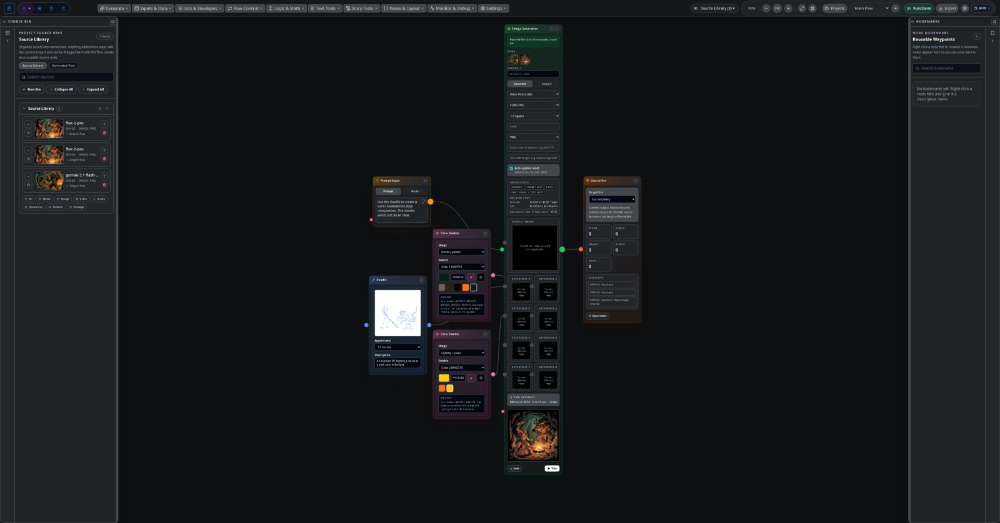

# 5. Flow workspace

**Flow** is where you generate. You build a **graph** of connected nodes — prompts, models, and
media — and run it. Think of it as a wiring diagram for a generation pipeline: instead of
re-typing a prompt and re-uploading a reference every time, you build the pipeline once and re-run
or tweak it.

## The canvas

The center is an infinite node canvas. You can pan, zoom, and arrange nodes freely. Connections
("edges") carry a result from one node's output to another node's input — for example a text
node's output into an image node's prompt, or an image node's output into a video node's first
frame.

- **Add a node** from the toolbar / add menu.
- **Connect nodes** by dragging from an output handle to an input handle.
- **Group nodes** into labelled groups to keep a large pipeline organized.
- **Run** a node to generate; its result is captured in the [source library](09-source-library.md)
  and shown on the node.

## Node types

Flow nodes cover the media types and the glue between them:

- **Text** — write or transform prompts; chain text into downstream nodes.
- **Image** — text-to-image, image-to-image, edit/inpaint, and reference-guided models *(needs a
  provider key)*.
- **Video** — text-to-video and image-to-video, including providers that generate asynchronously
  (start, then poll) *(needs a provider key)*.
- **Audio / sound effect / music** — generate voice and audio *(needs a provider key)*.
- **Composition** — assemble layers/clips into a single output.

Each generative node lets you pick the **model** and its parameters. Because capabilities follow
the model, a node only shows controls (reference image, mask, aspect ratio, seed, steps, …) that
the chosen model actually supports.

## Cost-aware runs

Every generative node shows a **run-cost estimate** before you press Generate, and tracks cost as
you go. You're billed directly by the provider (see [Providers](04-providers-and-keys.md)), so the
estimate is there to keep you in control — choose a cheaper model for drafts and a pricier one for
the final.

## Source bins & bookmarks

Two rails make a large graph manageable:

- **Source Bin** (left) — the shared asset library. Drag any asset out as a reusable **source
  node**, and anything you generate lands back here. See [The source library](09-source-library.md).
- **Bookmarks** (right) — "Reusable Waypoints." Rename a node and it appears here so you can jump
  straight back to it in a big pipeline.

## A typical pipeline

1. A **brief / text** node holds the concept.
2. It feeds an **image** node that generates references or key frames.
3. Selected frames feed a **video** node (image-to-video) or a **composition** node.
4. The outputs are all in the source library, ready to pull into **Image**, **Video**, or
   **Paper**.

Save the project and the whole graph — nodes, connections, parameters, and results — is preserved
in the `.sloom` file.

---

Next: [Image workspace →](06-image.md)
